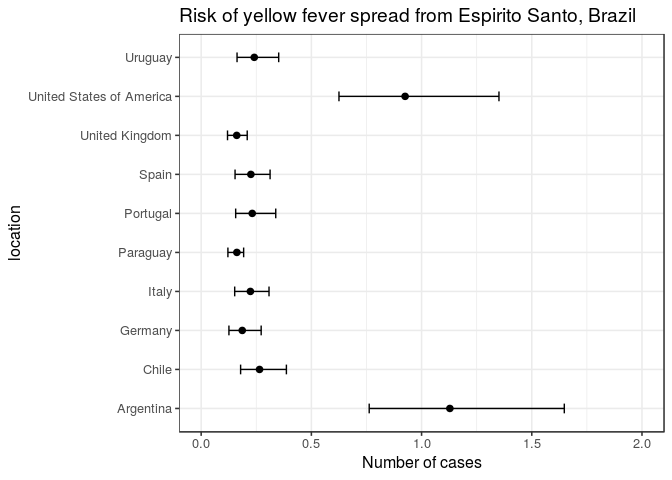

[](http://www.repostatus.org/#wip)
[](https://cran.r-project.org/package=epiflows)
[](https://travis-ci.org/reconhub/epiflows)
[](https://codecov.io/gh/reconhub/epiflows)

# Welcome to the *epiflows* package\!

`epiflows` is a package for predicting and visualising spread of
infectious diseases based on flows between geographical locations, e.g.,
countries. `epiflows` provides functions for calculating spread
estimates, handling flow data, and
visualization.

## Installing the package

<!-- To install the current stable, CRAN version of the package, type: -->

<!-- ```{r install, eval = FALSE} -->

<!-- install.packages("epiflows") -->

<!-- ``` -->

<!-- To benefit from the latest features and bug fixes, install the development, *github* version of the package using: -->

Currently, epiflows is a work in progress and can be installed from
github using the *remotes*, *ghit*, or *devtools*
package:

``` r
if (!require("remotes")) install.packages("remotes", repos = "https://cloud.rstudio.org")
remotes::install_github("reconhub/epiflows")
```

# What does it do?

The main features of the package include:

## Estimation of risk

  - `estimate_risk_spread()`: calculate estimates (point estimate and
    95% CI) for disease spread from flow data

### Example

Estimating the number of new cases flowing to other countries from
Espirito Santo, Brazil.

``` r
library("epicontacts")
library("epiflows")
```

    ## 
    ## Attaching package: 'epiflows'

    ## The following object is masked from 'package:epicontacts':
    ## 
    ##     get_id

``` r
library("ggplot2")
data("Brazil_epiflows")
print(Brazil_epiflows)
```

    ## 
    ## /// Epidemiological Flows //
    ## 
    ##   // class: epiflows, epicontacts
    ##   // 15 locations; 100 flows; directed
    ##   // optional variables: pop_size, duration_stay, num_cases, first_date, last_date 
    ## 
    ##   // locations
    ## 
    ## # A tibble: 15 x 6
    ##    id    location_popula… num_cases_time_… first_date_cases last_date_cases
    ##  * <chr>            <dbl>            <dbl> <fct>            <fct>          
    ##  1 Espi…          3973697             2600 2017-01-04       2017-04-30     
    ##  2 Mina…         20997560             4870 2016-12-19       2017-04-20     
    ##  3 Rio …         16635996              170 2017-02-19       2017-05-10     
    ##  4 Sao …         44749699              200 2016-12-17       2017-04-20     
    ##  5 Sout…         86356952             7840 2016-12-17       2017-05-10     
    ##  6 Arge…               NA               NA <NA>             <NA>           
    ##  7 Chile               NA               NA <NA>             <NA>           
    ##  8 Germ…               NA               NA <NA>             <NA>           
    ##  9 Italy               NA               NA <NA>             <NA>           
    ## 10 Para…               NA               NA <NA>             <NA>           
    ## 11 Port…               NA               NA <NA>             <NA>           
    ## 12 Spain               NA               NA <NA>             <NA>           
    ## 13 Unit…               NA               NA <NA>             <NA>           
    ## 14 Unit…               NA               NA <NA>             <NA>           
    ## 15 Urug…               NA               NA <NA>             <NA>           
    ## # ... with 1 more variable: length_of_stay <dbl>
    ## 
    ##   // flows
    ## 
    ## # A tibble: 100 x 3
    ##    from             to         n
    ##    <chr>            <chr>  <dbl>
    ##  1 Espirito Santo   Italy  2828.
    ##  2 Minas Gerais     Italy 15714.
    ##  3 Rio de Janeiro   Italy  8164.
    ##  4 Sao Paulo        Italy 34039.
    ##  5 Southeast Brazil Italy 76282.
    ##  6 Espirito Santo   Spain  3270.
    ##  7 Minas Gerais     Spain 18176.
    ##  8 Rio de Janeiro   Spain  9443.
    ##  9 Sao Paulo        Spain 39371.
    ## 10 Southeast Brazil Spain 88231.
    ## # ... with 90 more rows

``` r
res <- estimate_risk_spread(Brazil_epiflows, 
                            location_code = "Espirito Santo",
                            r_incubation = function(n) rlnorm(n, 1.46, 0.35),
                            r_infectious = function(n) rnorm(n, 4.5, 1.5/1.96),
                            n_sim = 1e5
                           )
```

    ## Exportations done

    ## Importations done

``` r
res
```

    ##                          mean_cases lower_limit_95CI upper_limit_95CI
    ## Italy                     0.2231523        0.1521121        0.3078378
    ## Spain                     0.2253126        0.1537608        0.3127081
    ## Portugal                  0.2315067        0.1565687        0.3383500
    ## Germany                   0.1862595        0.1259677        0.2722201
    ## United Kingdom            0.1612410        0.1195382        0.2089645
    ## United States of America  0.9245639        0.6252844        1.3512593
    ## Argentina                 1.1274019        0.7624641        1.6477091
    ## Chile                     0.2646030        0.1789552        0.3867279
    ## Uruguay                   0.2406887        0.1627847        0.3517829
    ## Paraguay                  0.1618671        0.1213237        0.1927066

``` r
res$location <- rownames(res)
ggplot(res, aes(x = mean_cases, y = location)) +
  geom_point(size = 2) +
  geom_errorbarh(aes(xmin = lower_limit_95CI, xmax = upper_limit_95CI), height = .25) +
  theme_bw(base_size = 12, base_family = "Helvetica") +
  ggtitle("Risk of yellow fever spread from Espirito Santo, Brazil") +
  xlab("Number of cases") +
  xlim(c(0, 2))
```

<!-- -->

## Data structure to store flows and metadata

  - `epiflows`: an S3 class for storing flow data, as well as country
    metadata. This class contains two data frames containing flows and
    location metadata based on the `epicontacts` class from the
    [epicontacts
    pacakge](http://www.repidemicsconsortium.org/epicontacts/).
  - `make_epiflows()`: a constructor for `epiflows` from either a pair
    of data frames or inflows and outflows and location data frame.
  - `add_coordinates()`: add latitude/longitude to the location data in
    an `epiflows` object using `ggmap::geocode()`

## Basic methods

  - `x[j = myLocations]`: subset an `epiflows` object to location(s)
    *myLocations*
  - `plot()`: plot flows from an `epiflows` object on a *leaflet* world
    map
  - `print()`: print summary for an `epiflows` object

## Accessors

  - `get_flows()`: return flow data
  - `get_locations()`: return metadata for all locations
  - `get_vars()`: access variables from metadata
  - `get_coordinates()`: return coordinates for each location (if
    provided)
  - `get_id()`: return a vector of location identifiers
  - `get_n()`: return the number of cases per flow
  - `get_pop_size()`: return the population size for each location (if
    provided)

# Resources

## Vignettes

An overview and examples of *epiflows* are provided in the vignettes:

…

## Getting help online

Bug reports and feature requests should be posted on *github* using the
[*issue*](http://github.com/reconhub/epiflows/issues) system. All other
questions should be posted on the **RECON forum**: <br>
<http://www.repidemicsconsortium.org/forum/>

Contributions are welcome via **pull requests**.

Please note that this project is released with a [Contributor Code of
Conduct](CONDUCT.md). By participating in this project you agree to
abide by its terms.
